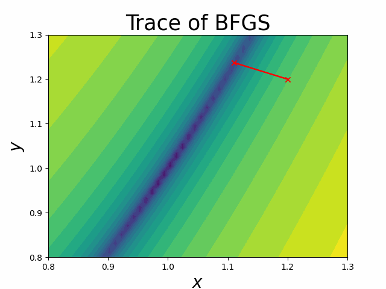

[](https://github.com/weiym97/SABS-BFGS/actions/workflows/unit_tests.yml)
[](https://github.com/weiym97/SABS-BFGS/actions/workflows/os-tests.yml)

# SABS-BFGS

### Description
This package is an implementation of the BFGS algorithm.

[BFGS](https://en.wikipedia.org/wiki/Broyden%E2%80%93Fletcher%E2%80%93Goldfarb%E2%80%93Shanno_algorithm) is an efficient way to find the global maximum/minimum of a function.

This project is a practical session of [Modelling and Scientific Computing Module](https://sabs-r3.github.io/scientific-computing) in the [SABS](https://www.sabsr3.ox.ac.uk) programme. 

### Installation

System: Windows 11, MacOS 13.1, Ubuntu20.04 LTS
```
git clone https://github.com/weiym97/SABS-BFGS
cd SABS-BFGS

# Create and activate a new virtual environment. you have many options: 
# For those with anaconda
conda create -n SABS-BFGS
conda activate SABS-BFGS
# For those without anaconda (uncomment the following two lines)
#python -m venv venv
#source venv/bin/activate

# Install dependencies
pip install -r requirements.txt
# Install the package
pip install .

```

### Usage
#### Example 1: find the global minimum of $f(x)=x^2$
```
from SABS_BFGS.bfgs import BFGS
bfgs = BFGS()
x0 = 1.0
x_argmin, f_min = bfgs.minimize(lambda x: x**2, x0)
print('Global minimum: ',x_argmin)
print('Minimal Value: ',format(float(f_min),".2f"))
```
#### Example 2: find the global minimum of Rosenbrock function $f(x,y)=(1-x)^2+(y-x^2)^2$.
```
import numpy as np
from SABS_BFGS.bfgs import BFGS
def func(x):
    return (1 - x[0]) ** 2 + (x[1] - x[0] ** 2) ** 2
bfgs = BFGS()
x0 = np.array([1.2,1.2])
x_argmin,fmin = bfgs.minimize(func,x0)
print('Global minimum: ',np.round(x_argmin,decimals=2))
print('Minimal Value: ',format(float(f_min),".2f"))
```
See below an visualisation of how it works


### Details
Read [introduction.ipynb](./introduction.ipynb) for more information, which includes a detailed description of how BFGS works.

### Credits
Thank [Martin Robinson](https://github.com/martinjrobins) for introducing us to this great module during the last two weeks. Also, I have received much help from all the demonstrators. I would like to express our gratitude to [Nele Quast](https://www.linkedin.com/in/nele-quast-760921130/?originalSubdomain=uk) for helping us on the visualisation of this project.